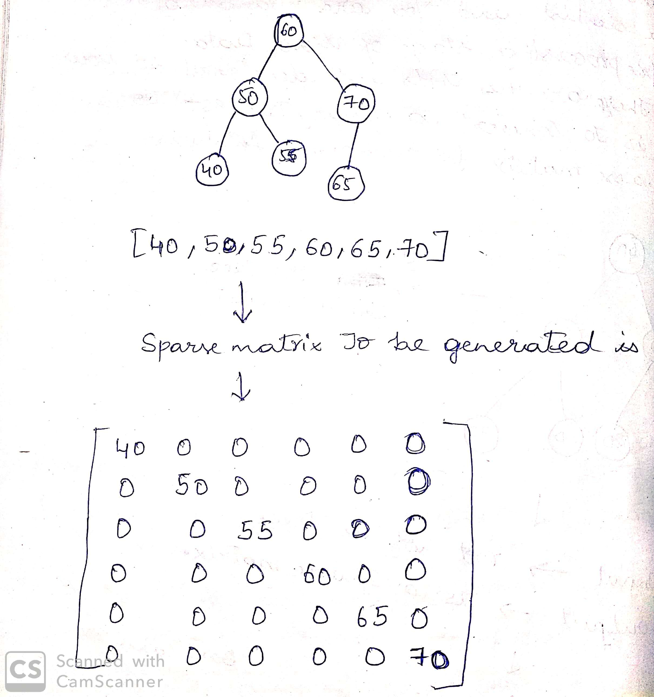
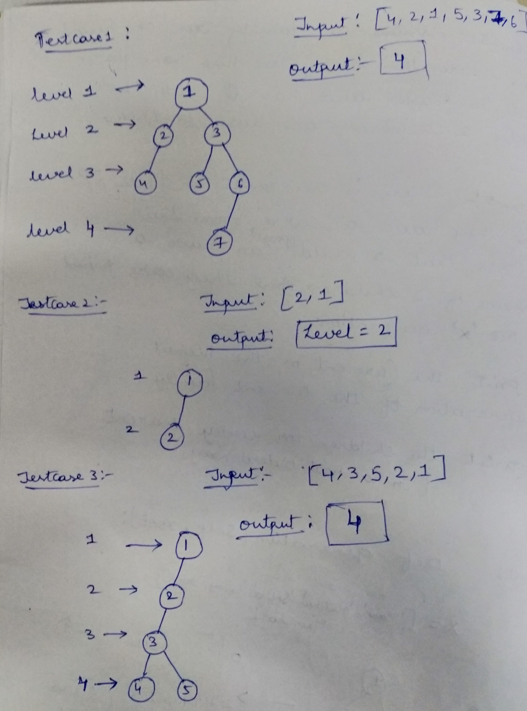

# Trees
This repository gives the unique questions on trees and gives you the flavour of solving the problems on trees  
# Question 1
1: Print The First Node Of Every Level (Hint: Using Level Order Traversal).  
 

# Question 2
2: Convert a Tree into Sparse Matrix (Hint: Traversal and Sparse Matrix Logic).  
 

# Question 3
3: Find the Left Max Value in a tree...(Hint: Tree Traversal and maximum finding)   
# Question 4
4: Find whether the binary tree has twins or not(Hint: Pre order Tree Traversal and checking)   
 

# Question 5
5: Find the Present Generation of the family Tree.  
 

